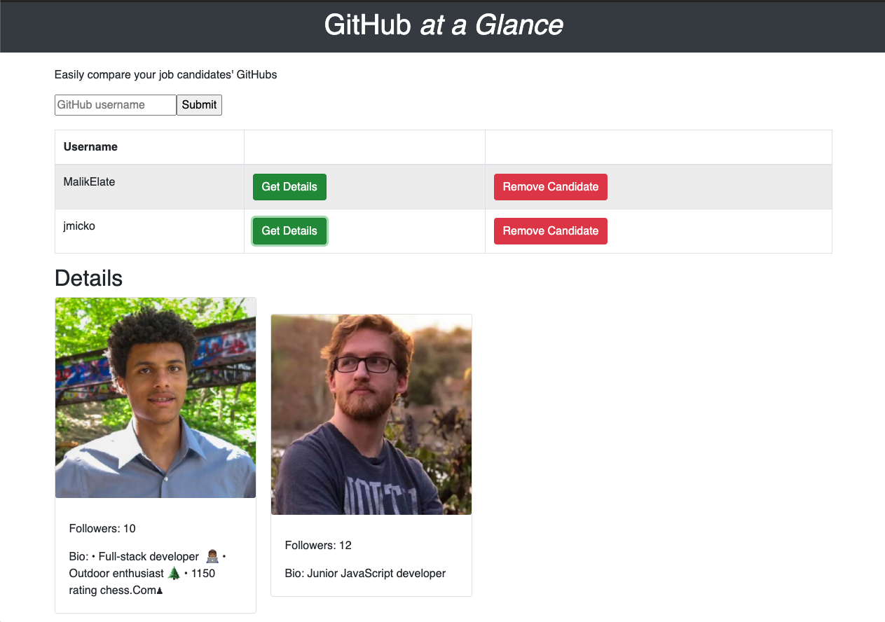

# GitHub at a Glance 

## Description

_Duration: 2 Week Sprint_

Before GitHub at a Glance if a recruiter wanted to compare multiple job candidates they needed to open millions of tabs. GitHub at a Glance solves the problem the problem by putting all of the candidates basic information on one screen. More easily compare candidates and make hiring decisions faster and more efficiently. 

To see the fully functional site, please visit: [DEPLOYED VERSION OF APP](https://powerful-anchorage-62234.herokuapp.com)

### Prerequisites

Link to software that is required to install the app (e.g. node).

- [Node.js](https://nodejs.org/en/)
- Node Package Manager 

## Installation

1. Create a database named react_student_list,
2. The queries in the `tables.sql` file are set up to create all the necessary tables and populate the needed data to allow the application to run correctly. The project is built on [Postgres](https://www.postgresql.org/download/), so you will need to make sure to have that installed. We recommend using Postico to run those queries as that was used to create the queries, 
3. Open up your editor of choice and run an `npm install`
4. Run `npm run server` in your terminal
5. Run `npm run client` in your terminal
6. The `npm run client` command will open up a new browser tab for you!

## Usage

1. Enter the candidates GitHub username to add them to the list of prospects
2. Click get details to view a candidates' details 
3. Remove a candidate from the list by clicking remove candidate

## Built With

1. React
2. JavaScript 
3. PostgreSQL 
4. Node + Express
5. React Bootstrap 
6. CSS 
7. HTML 
8. GitHub public API

## Acknowledgement
Thanks to [Prime Digital Academy](www.primeacademy.io) who equipped and helped me to make this application a reality.

## Support
If you have suggestions or issues, please email me at [youremail@whatever.com](www.google.com)

## Screen Shot

